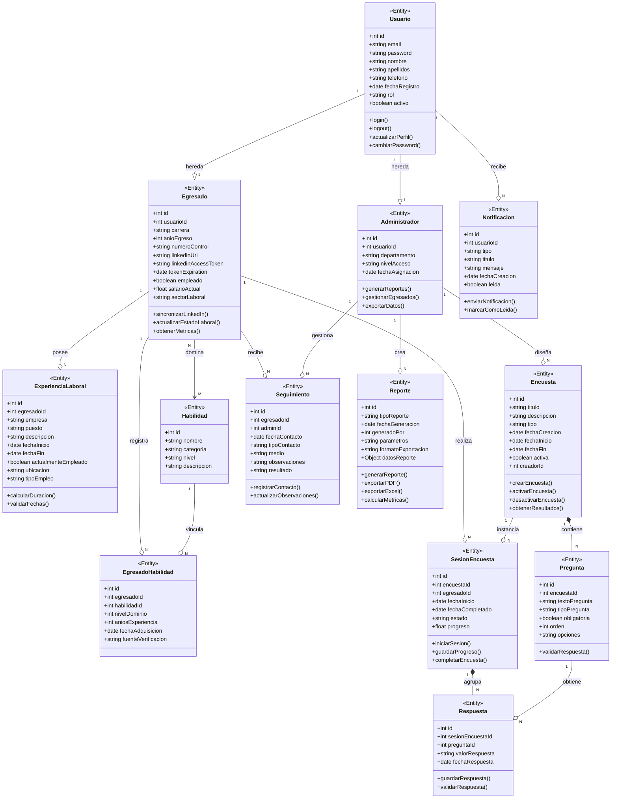

# Diagrama de Clases - SeguimientoApp

## Descripción

Este diagrama muestra la estructura de clases del sistema de seguimiento de egresados, incluyendo las entidades principales, sus atributos, métodos y relaciones.

## Cómo exportar a imagen

1. Copia el código del bloque `mermaid`
2. Ve a https://mermaid.live/
3. Pégalo y exporta como SVG/PNG

---

## Diagrama de Clases



---

## Descripción de las Clases

### 👤 Clases de Usuario

#### Usuario
Clase base que representa a cualquier usuario del sistema (egresado o administrador).
- **Atributos principales:** Datos de identificación y autenticación
- **Métodos clave:** Login, logout, gestión de perfil

#### Egresado
Especialización de Usuario que representa a un graduado del programa.
- **Atributos principales:** Información académica, laboral y de LinkedIn
- **Métodos clave:** Sincronización con LinkedIn, actualización de estado

#### Administrador
Especialización de Usuario con privilegios administrativos.
- **Atributos principales:** Departamento, nivel de acceso
- **Métodos clave:** Generación de reportes, gestión de egresados

---

### 💼 Clases de Información Profesional

#### ExperienciaLaboral
Registra el historial laboral de cada egresado.
- **Relación:** Cada egresado puede tener múltiples experiencias

#### Habilidad
Catálogo de habilidades técnicas y profesionales.
- **Relación:** Múltiples egresados pueden tener las mismas habilidades

#### EgresadoHabilidad
Tabla intermedia que vincula egresados con habilidades.
- **Atributos adicionales:** Nivel de dominio, años de experiencia

---

### 📋 Clases de Encuestas

#### Encuesta
Define las encuestas de seguimiento a egresados.
- **Atributos principales:** Título, descripción, fechas de vigencia
- **Métodos clave:** Activación, desactivación, obtención de resultados

#### Pregunta
Preguntas individuales dentro de una encuesta.
- **Atributos principales:** Texto, tipo (abierta/cerrada/múltiple), obligatoriedad

#### SesionEncuesta
Instancia de una encuesta respondida por un egresado.
- **Atributos principales:** Estado, progreso, fechas

#### Respuesta
Respuesta individual a una pregunta específica.
- **Relación:** Vincula sesión de encuesta con pregunta

---

### 📊 Clases de Gestión

#### Seguimiento
Registra los contactos entre administradores y egresados.
- **Atributos principales:** Tipo de contacto, medio, observaciones

#### Reporte
Almacena los reportes generados por el sistema.
- **Atributos principales:** Tipo, parámetros, datos calculados
- **Métodos clave:** Generación, exportación a PDF/Excel

#### Notificacion
Sistema de notificaciones para usuarios.
- **Atributos principales:** Tipo, mensaje, estado de lectura

---

## Relaciones Principales

### 🔹 Relaciones 1:1 (Uno a Uno) - Herencia
| Clase Padre | Clase Hija | Cardinalidad | Tipo | Descripción |
|-------------|------------|--------------|------|-------------|
| Usuario | Egresado | 1:1 | `--|>` Herencia | Un usuario puede ser un egresado |
| Usuario | Administrador | 1:1 | `--|>` Herencia | Un usuario puede ser un administrador |

**Notación:** `--|>` indica herencia (extends/inherits)

---

### 🔹 Relaciones 1:N (Uno a Muchos)

| Clase Origen | Clase Destino | Cardinalidad | Tipo | Descripción |
|--------------|---------------|--------------|------|-------------|
| Egresado | ExperienciaLaboral | 1:N | `--o` Agregación | Un egresado tiene múltiples experiencias laborales |
| Egresado | SesionEncuesta | 1:N | `--o` Agregación | Un egresado puede responder múltiples encuestas |
| Egresado | Seguimiento | 1:N | `--o` Agregación | Un egresado puede tener múltiples seguimientos |
| Administrador | Seguimiento | 1:N | `--o` Agregación | Un administrador realiza múltiples seguimientos |
| Administrador | Reporte | 1:N | `--o` Agregación | Un administrador genera múltiples reportes |
| Administrador | Encuesta | 1:N | `--o` Agregación | Un administrador crea múltiples encuestas |
| Encuesta | Pregunta | 1:N | `*--` Composición | Una encuesta contiene una o más preguntas |
| Encuesta | SesionEncuesta | 1:N | `--o` Agregación | Una encuesta genera múltiples sesiones |
| SesionEncuesta | Respuesta | 1:N | `*--` Composición | Una sesión contiene múltiples respuestas |
| Pregunta | Respuesta | 1:N | `--o` Agregación | Una pregunta recibe múltiples respuestas |
| Usuario | Notificacion | 1:N | `--o` Agregación | Un usuario recibe múltiples notificaciones |

**Notación:**
- `--o` indica agregación (puede existir independientemente)
- `*--` indica composición (no puede existir sin el contenedor)

---

### 🔹 Relaciones N:M (Muchos a Muchos)

| Clase A | Clase B | Cardinalidad | Tabla Intermedia | Tipo | Descripción |
|---------|---------|--------------|------------------|------|-------------|
| Egresado | Habilidad | N:M | EgresadoHabilidad | `-->` Asociación | Múltiples egresados pueden dominar múltiples habilidades |

**Implementación:**
- Se usa la tabla intermedia `EgresadoHabilidad`
- Permite almacenar atributos adicionales como `nivelDominio` y `aniosExperiencia`

---

## Cardinalidades Detalladas

### 📊 Tabla de Cardinalidades Completa

| Relación | Cardinalidad | Tipo | Lectura | Descripción |
|----------|--------------|------|---------|-------------|
| Usuario → Egresado | 1:1 | Herencia | Un usuario **es** un egresado | Relación de especialización |
| Usuario → Administrador | 1:1 | Herencia | Un usuario **es** un administrador | Relación de especialización |
| Egresado → ExperienciaLaboral | 1:N | Agregación | Un egresado **tiene** N experiencias | Historial laboral |
| Egresado → Habilidad | N:M | Asociación | N egresados **dominan** M habilidades | Competencias técnicas |
| Egresado → EgresadoHabilidad | 1:N | Agregación | Un egresado **registra** N vínculos | Tabla intermedia |
| Habilidad → EgresadoHabilidad | 1:N | Agregación | Una habilidad **vincula** N egresados | Tabla intermedia |
| Egresado → SesionEncuesta | 1:N | Agregación | Un egresado **responde** N encuestas | Historial de respuestas |
| Egresado → Seguimiento | 1:N | Agregación | Un egresado **recibe** N seguimientos | Historial de contactos |
| Administrador → Seguimiento | 1:N | Agregación | Un admin **realiza** N seguimientos | Gestión de contactos |
| Administrador → Reporte | 1:N | Agregación | Un admin **genera** N reportes | Análisis de datos |
| Administrador → Encuesta | 1:N | Agregación | Un admin **crea** N encuestas | Diseño de instrumentos |
| Encuesta → Pregunta | 1:N | Composición | Una encuesta **contiene** N preguntas | Estructura de encuesta |
| Encuesta → SesionEncuesta | 1:N | Agregación | Una encuesta **genera** N sesiones | Instancias de respuesta |
| SesionEncuesta → Respuesta | 1:N | Composición | Una sesión **agrupa** N respuestas | Respuestas individuales |
| Pregunta → Respuesta | 1:N | Agregación | Una pregunta **obtiene** N respuestas | Múltiples egresados responden |
| Usuario → Notificacion | 1:N | Agregación | Un usuario **recibe** N notificaciones | Sistema de alertas |

---

## Tipos de Relaciones Explicadas

### 🔺 Herencia (1:1) - `--|>`
```
Usuario --|> Egresado (1:1)
Usuario --|> Administrador (1:1)
```
- **Significado:** "es un tipo de"
- **Ejemplo:** Un Egresado **es un tipo de** Usuario
- **Características:** Hereda todos los atributos y métodos de Usuario
- **Cardinalidad:** Siempre 1:1

### 🔷 Composición (1:N) - `*--`
```
Encuesta *-- Pregunta (1:N)
SesionEncuesta *-- Respuesta (1:N)
```
- **Significado:** "contiene y controla el ciclo de vida"
- **Ejemplo:** Una Encuesta **contiene** N Preguntas
- **Características:** Si se elimina la encuesta, se eliminan sus preguntas
- **Cardinalidad:** 1:N (uno a muchos)

### 🔶 Agregación (1:N) - `--o`
```
Egresado --o ExperienciaLaboral (1:N)
Administrador --o Reporte (1:N)
```
- **Significado:** "tiene o posee"
- **Ejemplo:** Un Egresado **tiene** N Experiencias Laborales
- **Características:** Las experiencias pueden existir sin el egresado
- **Cardinalidad:** 1:N (uno a muchos)

### 🔹 Asociación (N:M) - `-->`
```
Egresado --> Habilidad (N:M)
```
- **Significado:** "está relacionado con"
- **Ejemplo:** N Egresados **están relacionados con** M Habilidades
- **Características:** Implementada con tabla intermedia (EgresadoHabilidad)
- **Cardinalidad:** N:M (muchos a muchos)

---

## Resumen de Cardinalidades

| Tipo de Relación | Notación | Cardinalidad | Ejemplo en el Sistema |
|------------------|----------|--------------|----------------------|
| **Herencia** | `--|>` | 1:1 | Usuario → Egresado |
| **Composición** | `*--` | 1:N | Encuesta → Pregunta |
| **Agregación** | `--o` | 1:N | Egresado → ExperienciaLaboral |
| **Asociación** | `-->` | N:M | Egresado → Habilidad |

---

## Patrones de Diseño Aplicados

### 1. **Herencia (Inheritance)**
- `Usuario` como clase base para `Egresado` y `Administrador`
- Permite reutilización de código y polimorfismo

### 2. **Tabla de Asociación (Junction Table)**
- `EgresadoHabilidad` vincula `Egresado` con `Habilidad`
- Permite atributos adicionales en la relación

### 3. **Composición**
- `Encuesta` compone `Pregunta`
- Las preguntas no existen sin una encuesta

### 4. **Agregación**
- `SesionEncuesta` agrega `Respuesta`
- Las respuestas pertenecen a una sesión específica

---

## Consideraciones Técnicas

### Base de Datos
- Todas las clases se mapean a tablas en MySQL
- Las relaciones N:M utilizan tablas intermedias
- Uso de claves foráneas para integridad referencial

### Backend (Node.js + Express)
- Cada clase tiene un modelo correspondiente
- Controladores manejan la lógica de negocio
- Uso de Sequelize como ORM para mapeo objeto-relacional

### Frontend (Angular)
- Interfaces TypeScript reflejan las clases del backend
- Servicios para comunicación con la API REST
- Modelos de dominio para tipado fuerte
