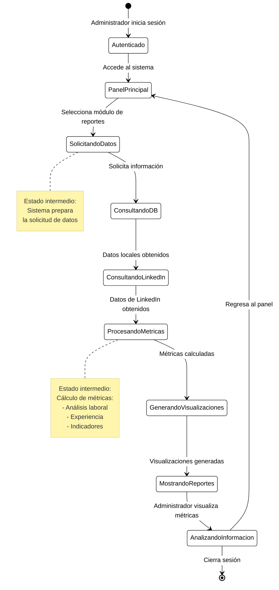

# Diagrama de Estados - Visualizar métricas y reportes de egresados

## Descripción

Este diagrama representa los estados por los que pasa el sistema durante el proceso de visualización de métricas y reportes de egresados, desde el estado inicial hasta el estado final, incluyendo estados intermedios.

## Cómo exportar a imagen

1. Copia el código del bloque `mermaid`
2. Ve a https://mermaid.live/
3. Pégalo y exporta como SVG/PNG
4. **Para blanco y negro**: En Mermaid Live, ve a "Configuration" y cambia `theme` a `base` o `neutral`

---

## Diagrama de Estados

