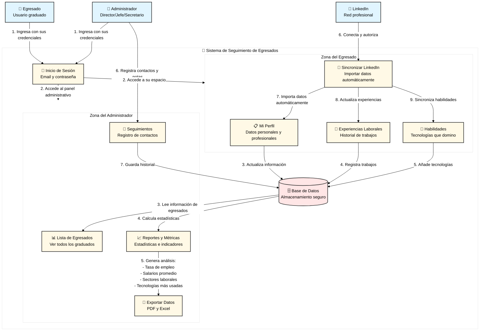

# Diagrama de Flujo de Datos de Alto Nivel - SeguimientoApp

## Descripción

Este diagrama muestra de forma **simple y visual** cómo fluyen los datos en el sistema de seguimiento de egresados, desde que un usuario ingresa hasta que obtiene información útil. Está diseñado para que cualquier persona (sin conocimientos técnicos) pueda entender cómo funciona la aplicación.

## Cómo exportar a imagen

1. Copia el código del bloque `mermaid`
2. Ve a https://mermaid.live/
3. Pégalo y exporta como SVG/PNG
4. **Para blanco y negro**: En Mermaid Live, cambia el tema a `base` o `neutral`

---

## Diagrama de Flujo de Datos



---

## Explicación Simple del Flujo de Datos

### 🎯 ¿Qué hace el sistema?

El sistema ayuda a **seguir la trayectoria profesional de los egresados** después de graduarse, permitiendo a la universidad:
- ✅ Saber dónde trabajan sus graduados
- ✅ Conocer qué tecnologías están usando en el mundo laboral
- ✅ Medir cuántos están empleados
- ✅ Generar reportes para mejorar los planes de estudio

---

### 👤 Flujo del Egresado (Usuario Graduado)

#### Paso 1: Ingreso al Sistema
El egresado entra con su **email y contraseña** al sistema.

#### Paso 2: Actualización de Perfil
Una vez dentro, puede:
- 📋 **Actualizar su información personal** (nombre, teléfono, email)
- 💼 **Registrar sus trabajos** (empresa, puesto, fechas)
- 🎯 **Listar sus habilidades** (lenguajes de programación, herramientas)

#### Paso 3: Sincronización con LinkedIn (Opcional)
Si el egresado tiene **LinkedIn**, puede:
- 🔗 **Conectar su cuenta** (una sola vez)
- 🔄 **Importar automáticamente** su información profesional
- ⚡ **Ahorrar tiempo** (no necesita escribir todo manualmente)

Los datos se **guardan de forma segura** en la base de datos del sistema.

---

### 👔 Flujo del Administrador (Director/Jefe/Secretario)

#### Paso 1: Ingreso al Sistema
El administrador entra con sus **credenciales especiales** al panel administrativo.

#### Paso 2: Consulta de Egresados
Puede ver:
- 📊 **Lista completa de egresados** con sus datos actualizados
- 🔍 **Buscar y filtrar** por carrera, año de egreso, etc.

#### Paso 3: Generación de Reportes
El sistema **calcula automáticamente** métricas importantes:
- 📈 **Tasa de empleabilidad**: ¿Cuántos están trabajando?
- 💰 **Salario promedio**: ¿Cuánto ganan?
- 🏢 **Sectores predominantes**: ¿En qué industrias trabajan?
- 💻 **Tecnologías más usadas**: ¿Qué herramientas demandan las empresas?

#### Paso 4: Registro de Seguimientos
El administrador puede:
- 📝 **Registrar contactos** con egresados (llamadas, emails, reuniones)
- 📋 **Agregar observaciones** sobre cada egresado
- 📅 **Llevar historial** de todas las interacciones

#### Paso 5: Exportación de Datos
Los reportes se pueden:
- 💾 **Exportar a PDF** (para presentaciones)
- 📊 **Exportar a Excel** (para análisis avanzados)

---

## 🔄 Ciclo Completo de los Datos

```
┌─────────────────────────────────────────────────────────────┐
│  1. Egresado actualiza su información (manual o LinkedIn)  │
└──────────────────────┬──────────────────────────────────────┘
                       │
                       ▼
┌─────────────────────────────────────────────────────────────┐
│  2. Datos se guardan en la base de datos del sistema       │
└──────────────────────┬──────────────────────────────────────┘
                       │
                       ▼
┌─────────────────────────────────────────────────────────────┐
│  3. Sistema procesa y calcula métricas automáticamente     │
└──────────────────────┬──────────────────────────────────────┘
                       │
                       ▼
┌─────────────────────────────────────────────────────────────┐
│  4. Administrador visualiza reportes actualizados          │
└──────────────────────┬──────────────────────────────────────┘
                       │
                       ▼
┌─────────────────────────────────────────────────────────────┐
│  5. Universidad toma decisiones basadas en datos reales    │
└─────────────────────────────────────────────────────────────┘
```

---

## 🔒 Seguridad y Privacidad

- 🔐 **Contraseñas encriptadas**: Nadie puede ver las contraseñas reales
- 🛡️ **Acceso por roles**: Cada usuario solo ve lo que le corresponde
- 🔑 **Tokens de LinkedIn**: Se guardan de forma segura y se renuevan automáticamente
- 📊 **Datos agregados**: Los reportes muestran estadísticas generales, no datos personales individuales

---

## 💡 Beneficios del Sistema

### Para el Egresado:
- ✅ Mantiene su perfil actualizado fácilmente
- ✅ Sincronización automática con LinkedIn
- ✅ Visibilidad ante la universidad

### Para la Universidad:
- ✅ Conoce el impacto real de sus programas
- ✅ Datos para acreditación y mejora continua
- ✅ Conexión permanente con egresados
- ✅ Reportes automáticos sin trabajo manual

### Para las Empresas:
- ✅ Conocen las competencias reales de los egresados
- ✅ Identifican candidatos potenciales
