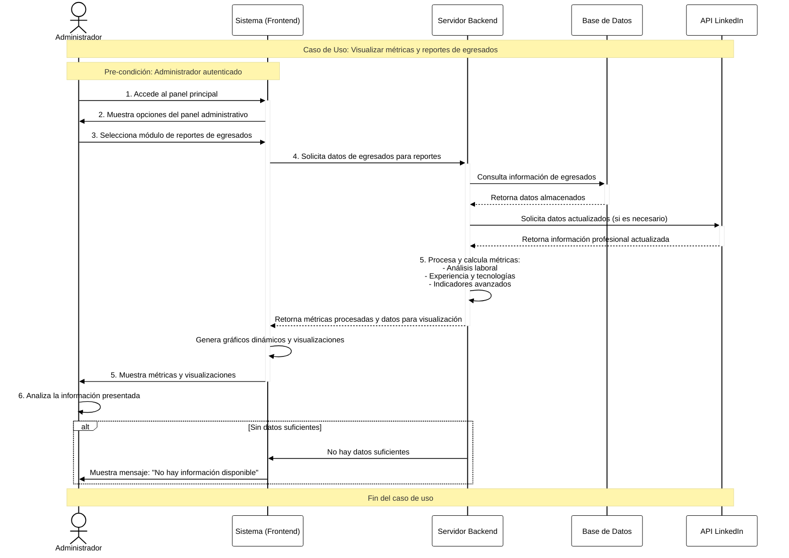

# Diagrama de Secuencia - Visualizar métricas y reportes de egresados

## Descripción

Este diagrama representa la interacción entre el **Administrador**, el **Sistema (Frontend)**, el **Backend** y la **API de LinkedIn** para el caso de uso "Visualizar métricas y reportes de egresados".

## Cómo exportar a imagen

1. Copia el código del bloque `mermaid`
2. Ve a https://mermaid.live/
3. Pégalo y exporta como SVG/PNG
4. **Para blanco y negro**: En Mermaid Live, ve a "Configuration" y cambia `theme` a `base` o `neutral`

---

## Diagrama de Secuencia

