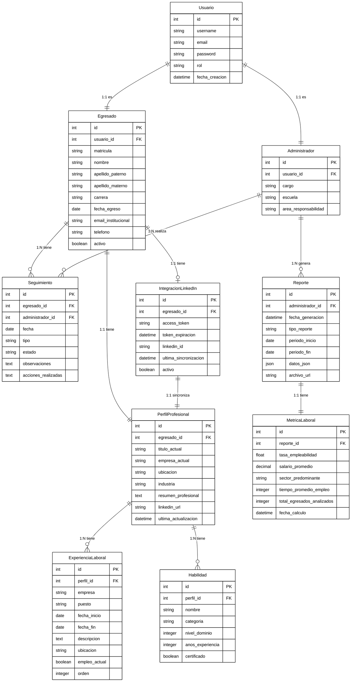

# Modelo Conceptual - SeguimientoApp

## Descripción

Este modelo conceptual muestra las funcionalidades que desarrollan las entidades más importantes de la herramienta. También se muestra la relación que existe entre ellas, basado en los modelos del backend Django.

## Cómo exportar a imagen

1. Copia el código del bloque `mermaid`
2. Ve a https://mermaid.live/
3. Pégalo y exporta como SVG/PNG
4. **Para blanco y negro**: En Mermaid Live, cambia el tema a `base` o `neutral`

---

## Diagrama del Modelo Conceptual

## Entidades Principales y sus Funcionalidades

### Usuario
Entidad base para autenticación y autorización del sistema.

**Atributos:**
- id (PK)
- username
- email
- password (encriptado)
- rol (Administrador/Egresado)
- fecha_creacion

**Funcionalidades:**
- Iniciar sesión
- Cerrar sesión
- Recuperar contraseña
- Actualizar perfil básico
- Gestionar permisos según rol

---

### Egresado
Representa a los graduados de la institución educativa.

**Atributos:**
- id (PK)
- usuario_id (FK)
- matricula (único)
- nombre, apellido_paterno, apellido_materno
- carrera
- fecha_egreso
- email_institucional
- telefono
- activo

**Funcionalidades:**
- Gestionar perfil profesional
- Actualizar información de contacto
- Registrar experiencias laborales
- Agregar habilidades técnicas
- Sincronizar datos con LinkedIn
- Ver historial de seguimientos

---

### Administrador
Usuario con privilegios administrativos (Director, Jefe de Carrera, Secretario).

**Atributos:**
- id (PK)
- usuario_id (FK)
- cargo
- escuela
- area_responsabilidad

**Funcionalidades:**
- Visualizar reportes y métricas
- Generar análisis estadísticos
- Gestionar egresados
- Realizar seguimientos
- Exportar datos (PDF/Excel)
- Consultar dashboard administrativo

---

### PerfilProfesional
Información profesional actual del egresado.

**Atributos:**
- id (PK)
- egresado_id (FK)
- titulo_actual
- empresa_actual
- ubicacion
- industria
- resumen_profesional
- linkedin_url
- ultima_actualizacion

**Funcionalidades:**
- Actualizar información profesional
- Importar datos desde LinkedIn
- Gestionar visibilidad de perfil
- Validar datos actualizados

---

### ExperienciaLaboral
Historial de empleos y experiencia del egresado.

**Atributos:**
- id (PK)
- perfil_id (FK)
- empresa
- puesto
- fecha_inicio, fecha_fin
- descripcion
- ubicacion
- empleo_actual (boolean)
- orden

**Funcionalidades:**
- Agregar nueva experiencia
- Editar experiencia existente
- Eliminar experiencia
- Marcar como empleo actual
- Ordenar cronológicamente

---

### Habilidad
Competencias técnicas y tecnologías dominadas.

**Atributos:**
- id (PK)
- perfil_id (FK)
- nombre
- categoria
- nivel_dominio (1-5)
- anos_experiencia
- certificado (boolean)

**Funcionalidades:**
- Agregar habilidad
- Actualizar nivel de dominio
- Indicar certificaciones
- Categorizar por tipo

---

### Seguimiento
Registro de interacciones y seguimiento del egresado.

**Atributos:**
- id (PK)
- egresado_id (FK)
- administrador_id (FK)
- fecha
- tipo (contacto/encuesta/entrevista)
- estado
- observaciones
- acciones_realizadas

**Funcionalidades:**
- Crear registro de seguimiento
- Actualizar estado
- Agregar observaciones
- Historial completo por egresado

---

### IntegracionLinkedIn
Gestión de conexión OAuth con LinkedIn.

**Atributos:**
- id (PK)
- egresado_id (FK)
- access_token (encriptado)
- token_expiracion
- linkedin_id
- ultima_sincronizacion
- activo

**Funcionalidades:**
- Autenticar con OAuth 2.0
- Renovar token de acceso
- Obtener datos de perfil
- Sincronizar experiencias
- Sincronizar habilidades
- Desconectar cuenta

---

### Reporte
Documentos y análisis generados por administradores.

**Atributos:**
- id (PK)
- administrador_id (FK)
- fecha_generacion
- tipo_reporte
- periodo_inicio, periodo_fin
- datos_json
- archivo_url

**Funcionalidades:**
- Generar reporte personalizado
- Exportar a PDF
- Exportar a Excel
- Filtrar por período
- Visualizar historial de reportes

---

### MetricaLaboral
Indicadores estadísticos calculados.

**Atributos:**
- id (PK)
- reporte_id (FK)
- tasa_empleabilidad (%)
- salario_promedio
- sector_predominante
- tiempo_promedio_empleo (meses)
- total_egresados_analizados
- fecha_calculo

**Funcionalidades:**
- Calcular empleabilidad
- Analizar distribución salarial
- Identificar sectores principales
- Calcular tiempo promedio de inserción laboral
- Generar tendencias temporales
- Comparar por cohorte/carrera

---

## Relaciones Principales

- **Usuario → Egresado** (1:1): Un usuario puede ser un egresado
- **Usuario → Administrador** (1:1): Un usuario puede ser un administrador
- **Egresado → PerfilProfesional** (1:1 tiene): Cada egresado tiene un perfil profesional
- **Egresado → Seguimiento** (1:N tiene): Un egresado puede tener múltiples seguimientos
- **Egresado → IntegracionLinkedIn** (1:1 tiene): Un egresado puede tener una integración con LinkedIn
- **PerfilProfesional → ExperienciaLaboral** (1:N tiene): Un perfil contiene múltiples experiencias laborales
- **PerfilProfesional → Habilidad** (1:N tiene): Un perfil contiene múltiples habilidades
- **IntegracionLinkedIn → PerfilProfesional** (1:1 sincroniza): La integración sincroniza con el perfil
- **Administrador → Reporte** (1:N genera): Un administrador genera múltiples reportes
- **Administrador → Seguimiento** (1:N realiza): Un administrador realiza múltiples seguimientos
- **Reporte → MetricaLaboral** (1:1 tiene): Cada reporte tiene una métrica laboral asociada
